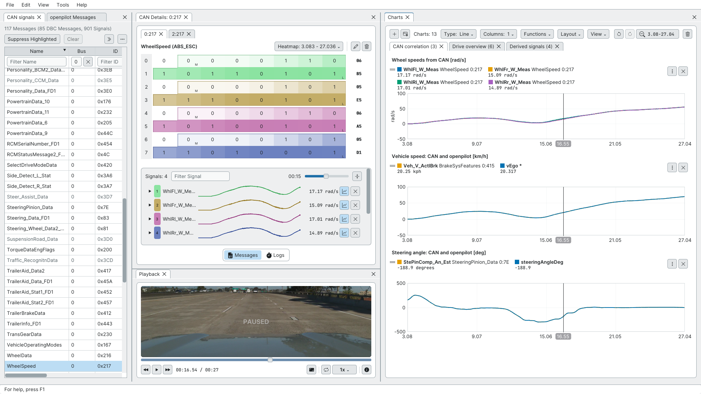
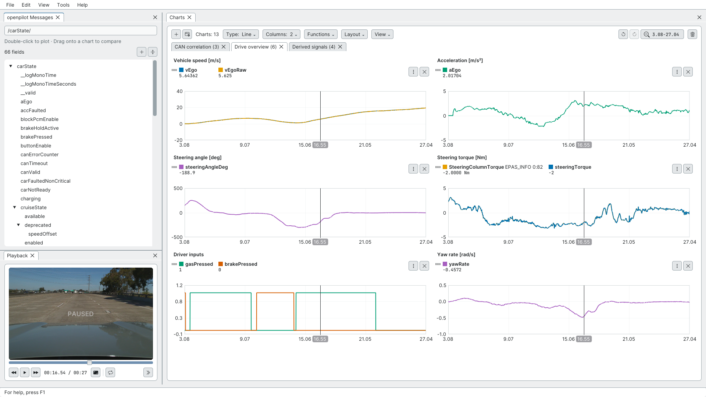
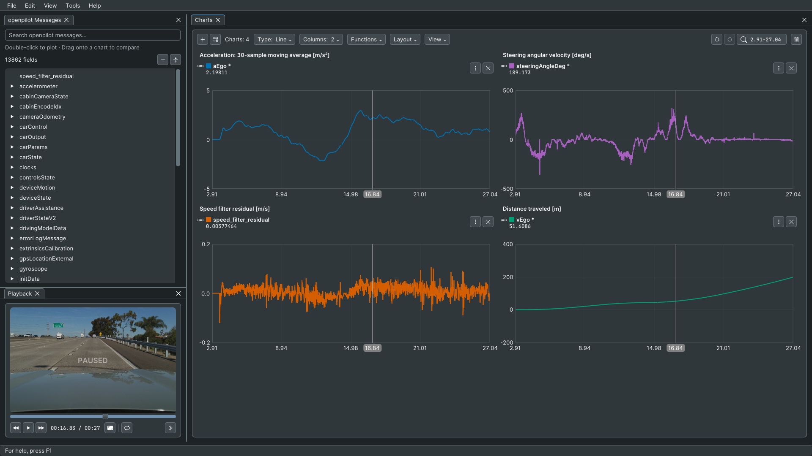
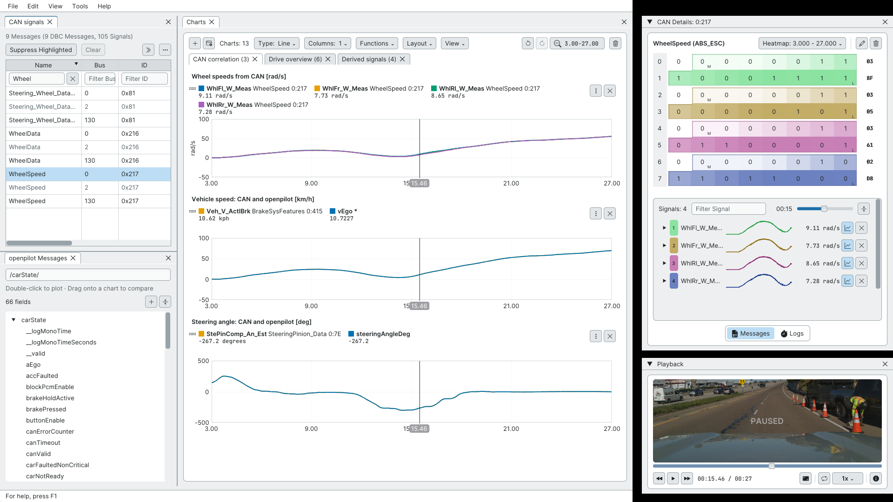
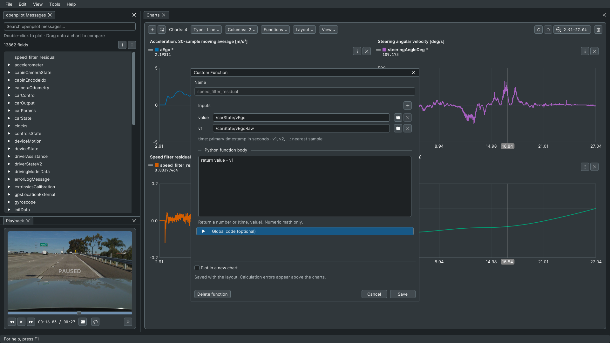

# Cabana plotting gallery

Five unedited 1920×1080 screenshots from a recorded Ford Bronco Sport route, captured under Xvfb for [openpilot PR #38792](https://github.com/commaai/openpilot/pull/38792). The application uses Cabana's existing light and dark themes and native docking controls.

## Reverse engineer a recorded route

Keep the CAN bit grid, decoded signals, synchronized video, and plots together. Compare all four wheel speeds, overlay decoded vehicle speed with openpilot's estimate, and check decoded steering against the logged steering angle. The vehicle-speed plot scales `/carState/vEgo` by 3.6 to compare both sources in km/h.



## Troubleshoot a recorded event

Give charts the main workspace and browse openpilot messages beside the video. Six plots show speed, acceleration, steering angle, steering torque, driver inputs, and yaw rate. The screenshot includes an optional Ford CAN torque trace; the downloadable openpilot-only overview omits that trace so it can be used without a DBC.



## Derive signals in dark mode

Apply a 30-sample moving average to acceleration, differentiate steering angle, integrate speed into distance, and compare filtered speed with raw speed using a Python function. Chart titles label the physical units for these particular fields.



## Arrange every panel independently

Show **CAN signals** and **openpilot Messages** at the same time. Float **CAN Details** and **Playback** into separate windows while keeping mixed CAN/openpilot charts in the main window. All five panels can be docked, floated, closed, and reopened from **View**. Inner CAN message tabs and chart page tabs organize their panel's contents; drag the outer panel title to move the whole panel.



## Build a custom comparison

The native function editor takes `/carState/vEgo` as `value` and `/carState/vEgoRaw` as `v1`. The body `return value - v1` produces the speed filter residual plotted in the previous screenshot. Functions are saved with chart layouts.



## Try the chart layouts

| Layout | Contents | Data needed |
| --- | --- | --- |
| [CAN and openpilot](layouts/can-and-openpilot.json) | Three named pages: CAN correlation, drive overview, and derived signals | Ford CAN decoded by `ford_lincoln_base_pt.dbc`, plus `carState` |
| [openpilot overview](layouts/openpilot-overview.json) | Six charts in two columns | `carState`; no DBC required |
| [Derived signals](layouts/derived-signals.json) | Four charts in two columns and the speed residual function | `carState`; no DBC required |

Download a JSON file using GitHub's **Raw** button, then open it from **Charts → Layout → Open Layout** or run this from the openpilot repository root:

```sh
openpilot/tools/cabana/cabana '<your route>' --layout /path/to/openpilot-overview.json
```

For the Ford CAN layout, load the matching DBC if it was not selected automatically:

```sh
openpilot/tools/cabana/cabana '<your Ford route>' \
  --dbc opendbc_repo/opendbc/dbc/ford_lincoln_base_pt.dbc \
  --layout /path/to/can-and-openpilot.json
```

The JSON files contain chart definitions and equations, with no route data. Fields absent from a recording show **No data**. The CAN layout refers to bus 0 messages `0x217`, `0x415`, `0x7E`, and `0x82`; use the log-only layouts for other cars.

Chart layouts restore pages, series, transforms, columns, and window duration. Dock placement, theme, and the current zoom are separate session settings. To recreate the views, drag panel titles into place, choose one column for CAN correlation or two for the overview and derived signals, then drag across a chart to zoom into an event. These captures show approximately seconds 3–27. Choose light or dark mode and adjust chart height in **Tools → Settings**. Close CAN Details when charts need more space, or select a CAN message to bring it back. Recorded routes and live streams use the same workspace.

## Validation

Validated against source commit `914c47c8e` after merging upstream master through `bb86bee68`.

- Cabana build and C++ core test executable passed.
- All 34 Python Cabana tests passed.
- Xvfb checks covered real-route playback and seeking, mixed CAN/openpilot plots, chart pages and columns, dark/light themes, transforms and Python functions, panel docking and floating, and reopening closed floating panels.
- Double-clicking an openpilot field created a chart; dragging a field onto a CAN chart added it to the existing plot.
- Each supplied chart layout was loaded in the application. The portable overview loaded all six charts without any CAN series.
- A separate live CAN regression check restored an inspector before data arrived, sent valid → invalid → valid frame sizes, and verified that the size warning appeared only for the invalid frame.

These assets live on a separate gallery branch so screenshots do not add binary files to the source PR.
